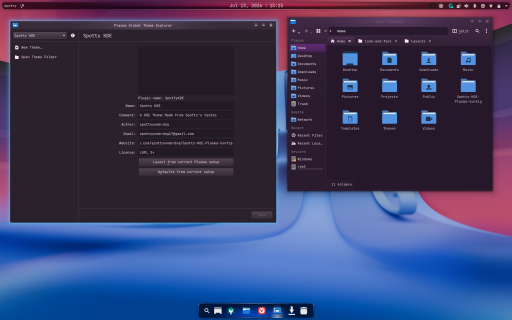

# Spotty-KDE-Plasma-Config
A Bash Script that installs Themes, Icon sets, boot &amp; login splashes, and any dependencies needed by theme. The script is designed for CachyOS, Though it should work in other Arch Based Linux Distros.

# Preview


# Important info
This script will install the following onto your system directory.
1. Oxygen Theme
    - Packages:
        - oxygen
        - oxygen-cursors 
        - oxygen-icons
        - oxygen-icons-svg
        - oxygen-sounds
        - oxygen5
    - Link:
        - https://github.com/KDE/oxygen
2. Papirus Icons
    - Link: https://github.com/PapirusDevelopmentTeam/papirus-icon-theme
3. Jet Brains Mono font
    - Links:
        - https://www.jetbrains.com/lp/mono/
        - https://github.com/JetBrains/JetBrainsMono
4. The Plymouth themes found in adi1090x's plymouth themes repository
    - Link: https://github.com/adi1090x/plymouth-themes
5. Plasma6 Window Title widget
    - Link: https://github.com/harunkrl/plasma6-window-title-applet
6. The Kwin Desktop Effects from Schneegan's Burn-My-Windows Repository
    - Link: https://github.com/Schneegans/Burn-My-Windows
7. Login Splashes Found in dgudim's Themes repository:
    - Link: https://github.com/dgudim/themes

# Installation & Setup

1. Download Repository and Run install script.
    **Installing From Main**
    ```
    # Clone main Repo
    git clone -b main https://github.com/spottyunderdog/Spotty-KDE-Plasma-Config

    # move into Repo directory
    cd Spotty-KDE-Plasma-Config

    # Install
    ./install.sh
    ```


    ** Installing From Experimental **
    ```
    # Clone Experimantal Repository
    git clone -b experimental https://github.com/spottyunderdog/Spotty-KDE-Plasma-Config

    # move into Repo directory
    cd Spotty-KDE-Plasma-Config

    # Install
    ./install.sh
    ```
    The Install script will install most of the dependencies system-wide(ie. /usr/share). The only exception are if you choose to install all splash screens, which will be install for the user only, to allow for the easy removal of the extra themes, as they will also appear as global themes.

The Script will automaticly
- Update the system
- Install oxygen
- Install Papirus icons
- Install JetBrains Mono Font
- Install Plymouth boot themes
- Install Window Title Applet
- Install Kwin Window Effects
- Install the Global theme
- Install One a Splash screen of the users choise to the Global theme.
- If the User wants, install all the available splash screens. They are install to the users .local/share/plasma/look-and-feel directory, for easy removal.

2. After installing you will have to go to ***System Settings*** > ***Appearance & Style*** > ***Global Theme*** and select *SpottyKDE*. If you want the included desktop layout, check the *Desktop and window layout* option, otherwise hit apply. ***Warning, if you choose to apply the Desktop and wind layout option, you will loose your current Desktop layout. You will need to reconfigure your wallpaper and taskbar.***

3. Select the Boot splash screen you would like to use. These are found in ***System Settings*** > ***Appearance & Style*** > ***Color & Themes*** > ***Boot Splash Scree*** If you would like to see a preview of them see [here](https://github.com/adi1090x/plymouth-themes).

4. In ***System Settings*** > ***Appearance & Style*** > ***Text & Fonts***, Click *Adjust All Fonts*, Check Font and select JetBrains Mono, then click ok.

5. Select the window animation you would like to use in ***System Settings*** > ***Appearance & Style*** > ***Animation***

# Unistalling
If you don't have the repository anymore, clone the repository, and enter it from the terminal. Then run the included Unistall stcript: *unistall.sh* The script will give you the option to remove the repository if you so choose.

# My Settings

1. ***System Settings*** > ***Appearance & Style*** > ***Global Theme***: SpottyKDE
2. ***System Settings*** > ***Appearance & Style*** > ***Global Theme*** > ***Colors*** Set Accent color to: Custom Accent Color, with the color code: #926ee4. By default KDE Colors gets the accent color form the color scheme. To set the color code, click accent color form color scheme and change it to Custom Accent Color. Then click the eyedropper and paste in the color code.
3. The Splash Screen I use is called *Illusion*. I have it installed with the SpottyKDE Config.
4. ***System Settings*** > ***Appearance & Style*** >  ***Animations*** I have the Winow open/close animation set to: TV Glitch \[Burn-My-Windows\] with the following settings:
Animation Time: 1050
Scale: 1.0
Strength: 10.0
Speed: 2.0
Color: #64a0ff