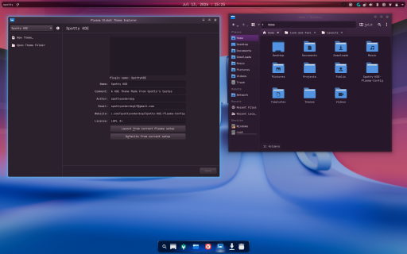

# Spotty-KDE-Plasma-Config
A Bash Script that installs Themes, Icon sets, boot &amp; login splashes, and any dependencies needed by theme. The script is designed for CachyOS, Though it should work in other Arch Based Linux Distros.

# Preview


# Important info
This script will install the following onto your system directory.
1. Oxygen Theme
    - Packages:
        - oxygen
        - oxygen-cursors 
        - oxygen-icons
        - oxygen-icons-svg
        - oxygen-sounds
        - oxygen5
    - Link:
        - https://github.com/KDE/oxygen
2. Papirus Icons
    - Link: https://github.com/PapirusDevelopmentTeam/papirus-icon-theme
3. Jet Brains Mono font
    - Links:
        - https://www.jetbrains.com/lp/mono/
        - https://github.com/JetBrains/JetBrainsMono
4. Jet Brains Mono Nerd Font
    - Links:
        - https://github.com/ryanoasis/nerd-fonts/tree/master/patched-fonts/JetBrainsMono
        - https://github.com/ryanoasis/nerd-fonts
5. The Plymouth themes found in adi1090x's plymouth themes repository
    - Link: https://github.com/adi1090x/plymouth-themes
6. Plasma6 Window Title widget
    - Link: https://github.com/harunkrl/plasma6-window-title-applet
7. The Kwin Desktop Effects from Schneegan's Burn-My-Windows Repository
    - Link: https://github.com/Schneegans/Burn-My-Windows
8. Login Splashes Found in dgudim's Themes repository:
    - Link: https://github.com/dgudim/themes

# Instalation

>[!IMPORTANT]
> Script Arguements. One of these must be provided at runtime or the script will not run

| Arguemnet | What it does |
| ------------- | ------------- |
| -u | Tells the script to install theme for the local user |
| --user | Tells the script to install theme for the local user |
| -s | Tells the script to install system theme wide |
| --system | Tells the script to install theme system wide |
| --uninstall | Tells the script to unistall theme |

## Installing From Repository

**Installing From Master**
```
    # Clone master Repo
    git clone -b master https://github.com/spottyunderdog/Spotty-KDE-Plasma-Config

    # move into Repo directory
    cd Spotty-KDE-Plasma-Config

    # Install For Local User
    ./SpottyKDE.sh -u
    # Install System Wide
    ./SpottyKDE.sh -s
```

**Installing From Development** (Not reccommended)
```
    # Clone development Repository
    git clone -b development https://github.com/spottyunderdog/Spotty-KDE-Plasma-Config

    # move into Repo directory
    cd Spotty-KDE-Plasma-Config

    # Install For Local User
    ./SpottyKDE.sh -u
    # Install System Wide
    ./SpottyKDE.sh -s
```

Note: Regardless of selected install method Plymouth themes will always be installed system-wide, and the "Add all login splash themes" question adds all themes to the local user directory. Plymouth themes need to be installed system wide in order to work as boot options, and the "Add all splash themes" option adds the login splashes to the local user directory to ensure the user can remove the themes they don't want easily since they get added as if they were "global" themes.

## Installing From Archive
1. There are 2 types of releases avaible to download, the Release and Pre-release. The release archives are based on the Master Branch, which gets updates when there is a stable, feature-complete, & funcitonal versions of the script. The Pre-Release verisions, are only functional and may contain incomplete or broken features. Release archive follow this naming format **SpottyKDEPlasma-[version].[tar.gz/zip]**; and the Pre-Releases follow this naming format **SpottyKDEPlasma-[version]-[alpha/beta].[num].[tar.gz/zip]**

2. Download the release that you want to install, I reccomend downloaded the [Latest, stable release](https://github.com/spottyunderdog/Spotty-KDE-Plasma-Config/releases/latest), and extract the archive. You can find the pre-releases [here](https://github.com/spottyunderdog/Spotty-KDE-Plasma-Config/releases/)

3. Enter the SpottyKDE-Plasma-Config Directory, or the directory where you extracted the files contents to, and then run the script. If the script is not executable open the terminal in the directory that has the install script and run:
```
chmod +x SpottyKDE.sh
```
and the file should now be executable. You can now run the script.

To run the script open your terminal and run the following (make sure to replace the path to the archive with the location you extracted the archive to)
```
cd /path/to/extracted/archive

# For Local User Installs
./SpottyKDE.sh -u

# For System-Wide Installs
./SpottyKDE.sh -s
```
Note: Regardless of selected install method Plymouth themes will always be installed system-wide, and the "Add all login splash themes" question adds all themes to the local user directory. Plymouth themes need to be installed system wide in order to work as boot options, and the "Add all splash themes" option adds the login splashes to the local user directory to ensure the user can remove the themes they don't want easily since they get added as if they were "global" themes.

## Post Intall Setup

1. After installing you will have to go to ***System Settings*** > ***Appearance & Style*** > ***Global Theme*** and select *SpottyKDE*. If you want the included desktop layout, check the *Desktop and window layout* option, otherwise hit apply. ***Warning, if you choose to apply the Desktop and wind layout option, you will loose your current Desktop layout. You will need to reconfigure your wallpaper and taskbar.***

2. Select the Boot splash screen you would like to use. These are found in ***System Settings*** > ***Appearance & Style*** > ***Color & Themes*** > ***Boot Splash Scree*** If you would like to see a preview of them see [here](https://github.com/adi1090x/plymouth-themes).

3. In ***System Settings*** > ***Appearance & Style*** > ***Text & Fonts***, Click *Adjust All Fonts*, Check Font and select JetBrains Mono, then click ok.

4. Select the window animation you would like to use in ***System Settings*** > ***Appearance & Style*** > ***Animation***

# Unistalling
1. Download the latest release or clone the repository if you don't already have it
2. Open the Spotty-KDE-Plasma-Config folder in the terminal, run the command bellow, and follow the onscreen prompts.
```
./SpottyKDE.sh --uninstall
```

# My Settings

1. ***System Settings*** > ***Appearance & Style*** > ***Global Theme***: SpottyKDE
2. ***System Settings*** > ***Appearance & Style*** > ***Global Theme*** > ***Colors*** Set Accent color to: Custom Accent Color, with the color code: #926ee4. By default KDE Colors gets the accent color form the color scheme. To set the color code, click accent color form color scheme and change it to Custom Accent Color. Then click the eyedropper and paste in the color code.
3. The Splash Screen I use is called *Illusion*. I have it installed with the SpottyKDE Config.
4. ***System Settings*** > ***Appearance & Style*** >  ***Animations*** I have the Winow open/close animation set to: TV Glitch \[Burn-My-Windows\] with the following settings:

Animation Time: 1050

Scale: 1.0

Strength: 10.0

Speed: 2.0

Color: #64a0ff

# ERROR CODES
>[!IMPORTANT]
>Error Codes

| Error Code  | Error Message | Cause |
| ------------- | ------------- | ------------- |
| 130  | Invalid Number of Arguements Provided | User should only provide one arguement to the script. If no arguements, or more then one arguement is provided then the script will exit with this message |
| 131 | Invalid Arguement Provided | The user didn't type in a valid arguement to the script, double check you have typed them correctly |

>[!IMPORTANT]
> Debugging Error codes, These should not occur while running the script if they do open a bug report via the issues page on the repo.

| Error Code | Error Message | Cause |
| ------------- | ------------- | ------------- |
| 141 | Invalid option or no option provided in function call | Occurs if the install type is not properly passed to installJetBrainsMono Function |
| 142 | Invalid option or no option provided in function call |  Occurs if the install type is not properly passed to instalPapirusIcons function |
| 143 | Invalid option or no option provided in function call | Occurs if the install type is not properly passed to installSpottyKDE function |
| 144 | Invalid option or no option provided in function call | Occurs if the install type is not properly passed to installSplashScreens Functions |
| 145 | Invalid option or no option provided in function call | Occurs if the install type is not properly passed to installPlasmaWindowApplet Function |